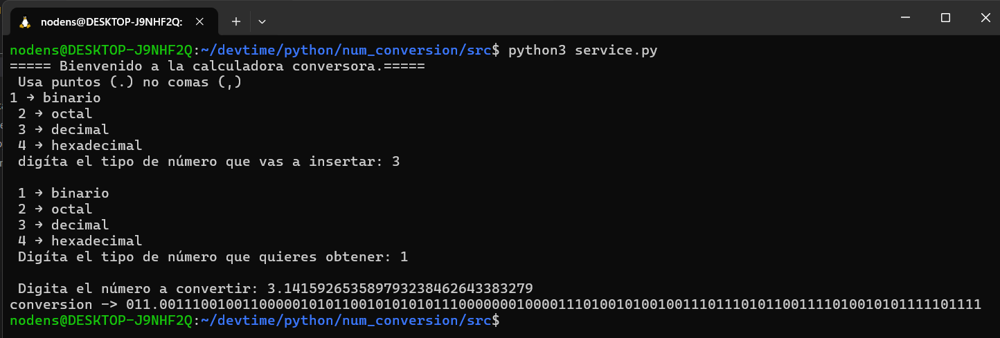

# Conversión de números 
El siguiente proyecto soporta las siguientes conversiones:  
- binaria  
- octal
- décimal
- hexadécimal  

## Características:  
- Puede convertir enteros y decimales con n cantidad de digitos en su mantisa.  
- Tiene una gran presición en su parte de la mantisa.  
- Funciona en una shell:  

  
(convierte los primeros 30 decimales de pi a binario)

## cómo ejecutar el conversor:
1. Desacarga el proyecto.
2. En una shell, ejecuta el archivo `service.py` con el comando `python3 service.py`  
3. Escribe lo que te piden en la consola y obtén el resultado.
## cosas por mejorar:
- Tiene mucho acoplamiento en service.py  
- La conversión a de decimal a octal ó octal a decimal tiene un pequeño margen de error.

## Diagrama de clases:
  

Hecho con: Luisa Ariza